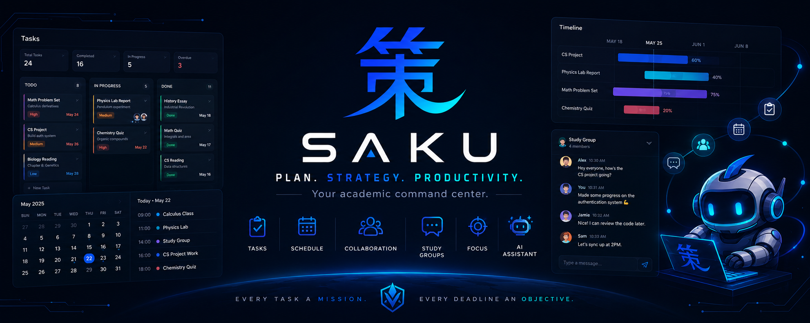

<div align="center">



# 策 Saku

**Plan · Strategy · Policy**

*Your personal tactical command center for school.*

<br />

[](../../saku-frontend)
[](../../saku-backend)
[](../../saku-backend)
[](../../saku-backend)
[](#license)

</div>

---

## ⚔️ What is Saku?

**Saku (策)** — Japanese for *plan*, *strategy*, or *policy* — turns the school dashboard into a tactical command center. Built for students and educators who treat academic life like a campaign: every task a mission, every deadline an objective, every study group a squad.

Stop juggling sticky notes, scattered calendars, and five group chats. Saku unifies tasks, schedules, collaboration, and an AI strategist into a single dark-themed interface engineered for long study sessions and sharp focus.

## 🗺️ The Repositories

| Repo | Role | Stack |
|------|------|-------|
| **[saku-frontend](../../saku-frontend)** | The command deck — app UI | Next.js 16 · React 19 · Tailwind v4 · shadcn/ui |
| **[saku-backend](../../saku-backend)** | The war room — API, realtime, AI | NestJS 11 · Prisma · PostgreSQL · Socket.io |
| **[saku-landing](../../saku-landing)** | The recruiting poster — marketing site | Next.js 16 · Tailwind v4 |

```
┌──────────────┐      REST + JWT       ┌──────────────┐      Prisma 7      ┌──────────────┐
│ saku-frontend│ ───────────────────▶  │ saku-backend │ ─────────────────▶ │  PostgreSQL  │
│  Next.js 16  │ ◀───────────────────  │  NestJS 11   │                    └──────────────┘
└──────────────┘   Socket.io realtime  └──────┬───────┘
                                              │
                                       ┌──────┴───────┐
                                       │  AI Agent ·  │
                                       │  Cloudinary  │
                                       └──────────────┘
```

## 🎯 Core Modules

### 📋 Task Management
Create, prioritize, and track assignments across subjects. Status flow (`TODO → IN_PROGRESS → DONE`, auto-`EXPIRED`), 0–100 progress tracking, priorities, deadlines, and personal **or** group tasks. List view and Kanban board. Watch real-time stats update as you grind your workload.

### 🗓️ Scheduler & Calendar
Three views, one source of truth — **month calendar** for the long game, **daily hour-by-hour** slots for tactical execution, and a **timeline** for deadline visualization. Event types (`EVENT` / `MEETING` / `TASK_REMINDER`), color-coding, importance levels, and **automatic conflict detection** so two missions never collide.

### 👥 Study Groups & Social
Friend system with requests, search by email / name / ID, and mutual connections. Create groups, invite friends, assign roles (`ADMIN` / `MODERATOR` / `MEMBER`), transfer command, and gate who can schedule. Squad up, then deploy.

### 💬 Realtime Chat
Group rooms **and** direct messages over WebSockets (Socket.io). Persistent history, read receipts, Markdown support, and a floating minimizable widget for mid-mission comms. Zero friction.

### 🤖 AI Scheduling Assistant *(new)*
A chat-based agent that reads your tasks and schedule and helps you plan. Persistent conversations, tool-calling to create and manage missions on your behalf. Your personal chief of staff.

## 🧰 Tech Stack

**Frontend** — `Next.js 16` · `React 19` · `TypeScript 5.7` · `Tailwind CSS v4` · `shadcn/ui` · `Framer Motion` · `axios` · `Socket.io-client` · `React Hook Form + Zod` · `Recharts`

**Backend** — `NestJS 11` · `TypeScript 5.7` · `Prisma 7` · `PostgreSQL` · `Socket.io` · `JWT + bcrypt` · `Cloudinary` · `Swagger / Scalar` · `Jest` (e2e + testcontainers)

**Architecture** — Domain-Driven Design on core modules · JWT-guarded REST · WebSocket gateway · health checks (liveness/readiness) for container orchestration.

## 🎨 Design Philosophy

- **🌑 Dark-first** — engineered for late-night study sessions
- **⚡ Tactical** — every screen optimized for decisive action
- **📱 Responsive** — mobile, tablet, desktop
- **✨ Animated** — glass-morphism, gradient glows, motion that aids comprehension — never distracts
- **♿ Accessible** — focus indicators, ARIA labels, `prefers-reduced-motion` respected

## 🚀 Get Started

Saku runs as two services. Spin up the backend, then the frontend.

**Backend** ([saku-backend](../../saku-backend))
```bash
pnpm install
# set DATABASE_URL, JWT_SECRET, CLOUDINARY_* in .env
pnpm prisma migrate deploy
pnpm run start:dev          # API on :3001 · docs at /docs
```

**Frontend** ([saku-frontend](../../saku-frontend))
```bash
pnpm install
echo "NEXT_PUBLIC_API_URL=http://localhost:3001" > .env.local
pnpm run dev                # app on :3000
```

## 🛣️ Roadmap

**✅ Shipped** — Multi-user JWT auth · WebSocket realtime sync · AI task/schedule assistant · Friend system & group roles · Direct messages · Avatar uploads

**🔜 Next** — Push notifications · Google Calendar integration · Drag-and-drop rescheduling · Export to PDF / iCal · Theme variants

## 🤝 Contributing

Pull requests welcome. Open an issue first for major changes.

## 📄 License

MIT — use freely, personal or commercial.

---

<div align="center">

**Built for students who plan to win.**

策 — *the strategy is the system*

</div>
